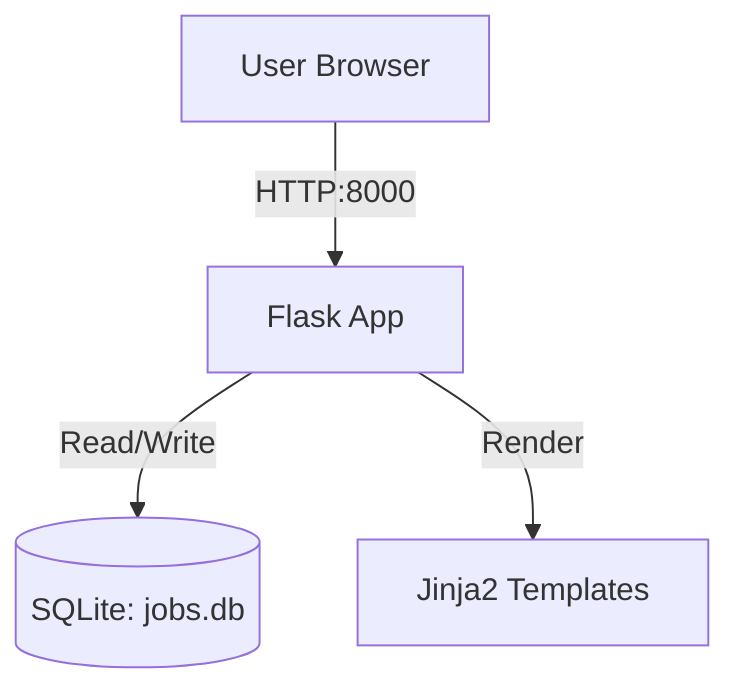

# Job Board Application

A production-ready Python Flask application for a Job Board, featuring a clean UI, admin authentication, and a single-file architecture for reliability.

## Project Title & Description
**Job Board Application**
This is a lightweight yet fully functional job board platform. It allows users to browse, search, and filter job listings, view detailed job descriptions, and find out how to apply. Administrators can log in to post new job opportunities. The application is built with Flask, SQLAlchemy, and Jinja2, utilizing a SQLite database for storage.

## Setup Instructions

### Local Development
1.  **Clone the repository** (if applicable) or download the source code.
2.  **Create a virtual environment:**
    ```bash
    python -m venv venv
    source venv/bin/activate  # On Windows: venv\Scripts\activate
    ```
3.  **Install dependencies:**
    ```bash
    pip install -r requirements.txt
    ```
4.  **Run the application:**
    ```bash
    python app.py
    ```
5.  Access the app at `http://localhost:8000`.

### Docker Deployment
1.  **Build the Docker image:**
    ```bash
    docker build -t jobboard-app .
    ```
2.  **Run the container:**
    ```bash
    docker run -p 8000:8000 jobboard-app
    ```
3.  Access the app at `http://localhost:8000`.

## Login Credentials
To post jobs, log in with the hardcoded admin credentials:
*   **Username:** `admin`
*   **Password:** `admin123`

## API Endpoints
*   `GET /`: Home page (List jobs, Search, Filter)
*   `GET /job/<id>`: Job Detail View
*   `GET /login`: Admin Login Form
*   `POST /login`: Handle Login
*   `GET /logout`: Logout Admin
*   `GET /admin/post`: Post Job Form (Protected)
*   `POST /admin/post`: Handle Job Creation (Protected)
*   `GET /health`: Health Check (`{"status": "ok"}`)

## Architecture Diagram



## Original Prompt
"Build a production-ready Python Flask application for a Job Board with the following specifications.

## Project Structure
The application must use a **Single-File Architecture** for Python code to ensure reliability.
```
.
├── app.py              # ALL application code (routes, models, db, auth)
├── requirements.txt    # Dependencies
├── Dockerfile          # Deployment configuration
├── README.md           # Documentation
└── templates/          # Jinja2 templates
    ├── base.html       # Layout with embedded CSS
    ├── index.html      # Home page with list, search, and filters
    ├── detail.html     # Job detail view
    ├── login.html      # Admin login
    └── post_job.html   # Admin job creation form
```

## Infrastructure Requirements
1. **Main File:** `app.py`
2. **Port:** MUST listen on `0.0.0.0:8000`
3. **Database:** SQLite stored at `data/jobs.db`
   - Ensure `data/` directory is created in code before DB access
   - Use SQLAlchemy for ORM
4. **Health Check:** `GET /health` returning `{\"status\": \"ok\"}`
5. **Dockerfile:**
   - Base: `python:3.11-slim`
   - Install dependencies
   - `RUN mkdir -p data templates`
   - Expose port 8000
   - CMD: `[\"python\", \"app.py\"]`

## Application Logic (`app.py`)
- **Imports:** Flask, SQLAlchemy, datetime, os
- **Config:** Secret key for sessions, SQLite URI
- **Model:** `Job`
  - Fields: `id` (Integer, PK), `title` (String), `company` (String), `location` (String), `job_type` (String: Full-time, Part-time, Contract, Remote), `description` (Text), `requirements` (Text), `salary_range` (String), `how_to_apply` (Text), `posted_date` (DateTime, default=now)
- **Seeding:**
  - On startup, check if `Job` table is empty.
  - If empty, insert **12 realistic job postings** (e.g., \"Senior Python Developer\", \"DevOps Engineer\", \"Marketing Manager\") across different companies and types.
- **Authentication:**
  - Hardcoded admin credentials: `admin` / `admin123`
  - Use Flask `session` to store login state (`session['is_admin'] = True`)
  - Protect the Post Job route with a login check decorator or logic

## Routes
1. `GET /` (Home):
   - Display list of jobs sorted by date (newest first).
   - Accept query parameters: `q` (search keyword for title/company) and `type` (filter by job_type).
   - Display search bar and filter dropdowns.
2. `GET /job/<int:job_id>`:
   - Show full job details.
   - \"Apply Now\" button (can be a `mailto:` link or simple text instruction).
3. `GET /login` & `POST /login`:
   - Admin login form.
   - On success, redirect to `/admin/post`.
4. `GET /logout`:
   - Clear session, redirect to Home.
5. `GET /admin/post` & `POST /admin/post`:
   - Protected route (require login).
   - Form to add a new job.
   - On success, flash message and redirect to Home.

## Frontend (Jinja2 + Embedded CSS)
- **Design:** Clean, professional.
  - Background: White/Light Gray (`#f8f9fa`)
  - Header/Nav: Navy Blue (`#1a1a2e`) with White text
  - Accents/Buttons: Subtle Green (`#10b981`)
  - Cards: White with soft shadow for job listings
- **Templates:**
  - `base.html`: Contains `<!DOCTYPE html>`, `<head>` with embedded `<style>`, Navigation (Home, Search, Admin Login/Post Job), and Flash messages.
  - `index.html`: Job list loop. Each card shows Title, Company, Location, Type badge, Date.
  - `detail.html`: Full content.
  - `post_job.html`: Form with fields for all Job attributes.

## Documentation (README.md)
Include the following sections EXACTLY:
1. **Project Title & Description**
2. **Setup Instructions** (Local & Docker)
3. **Login Credentials** (Admin: admin/admin123)
4. **API Endpoints** (List all routes)
5. **Mermaid Architecture Diagram**:
   ```mermaid
   graph TD
     User[User Browser] -->|HTTP:8000| App[Flask App]
     App -->|Read/Write| DB[(SQLite: jobs.db)]
     App -->|Render| T[Jinja2 Templates]
   ```
6. **Original Prompt**: Include the full text of the user's original request.

## Dependencies (`requirements.txt`)
```text
flask
sqlalchemy
```

**CRITICAL:** Do NOT create a `static/` folder. Embed all CSS in `base.html`. Do NOT use `debug=True` in the final `app.run()`."
